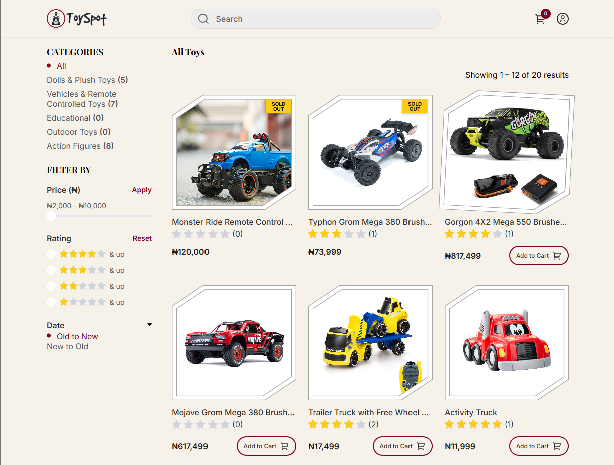
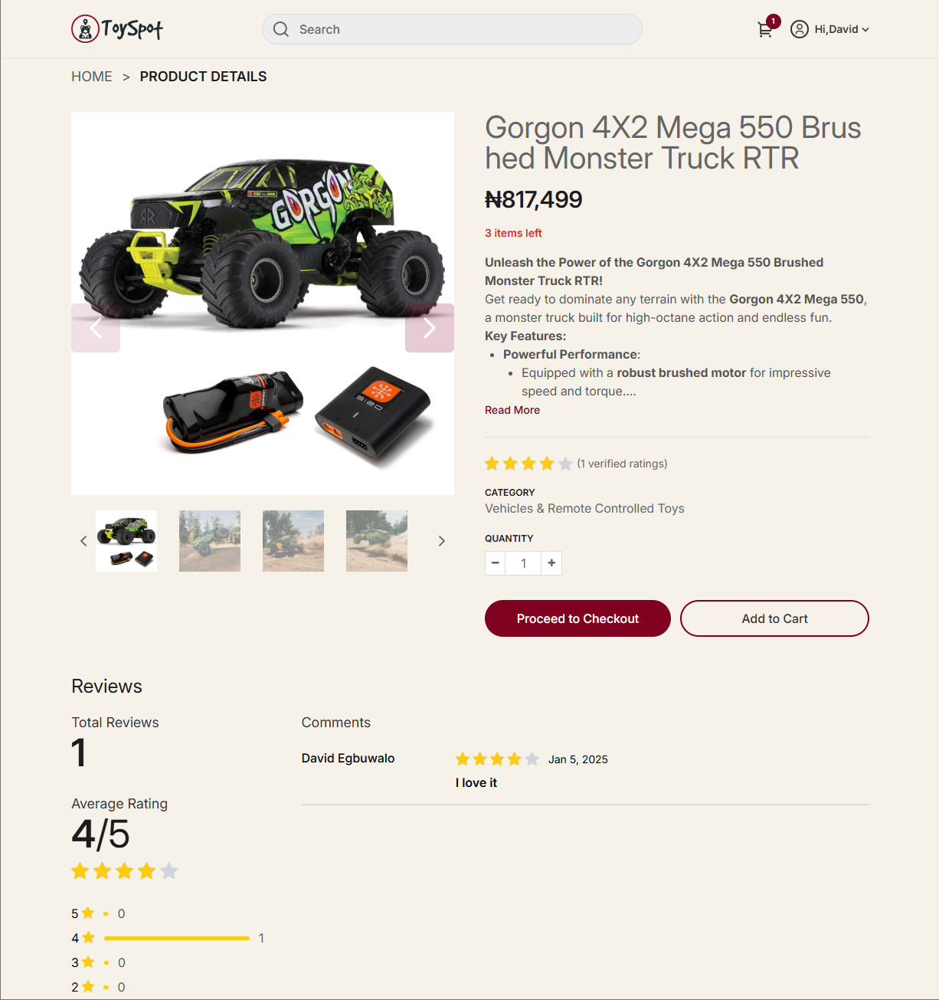
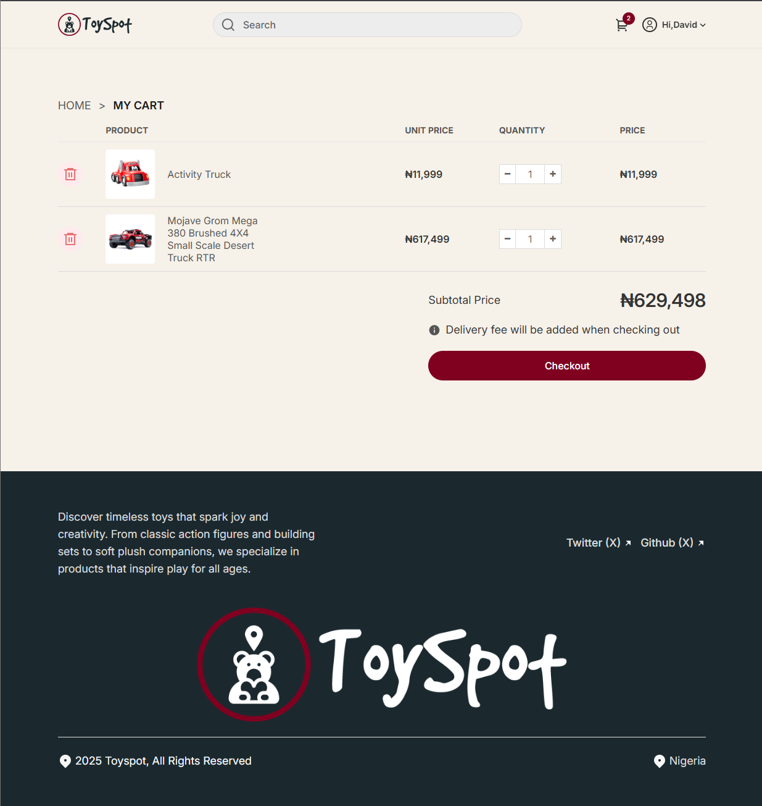
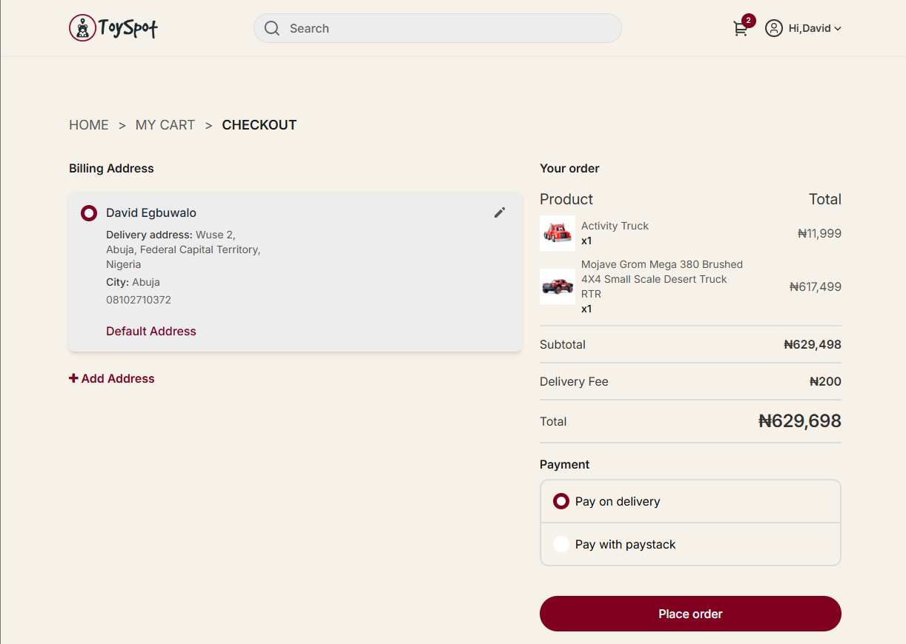
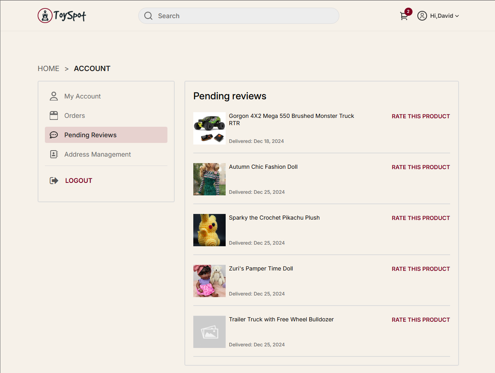
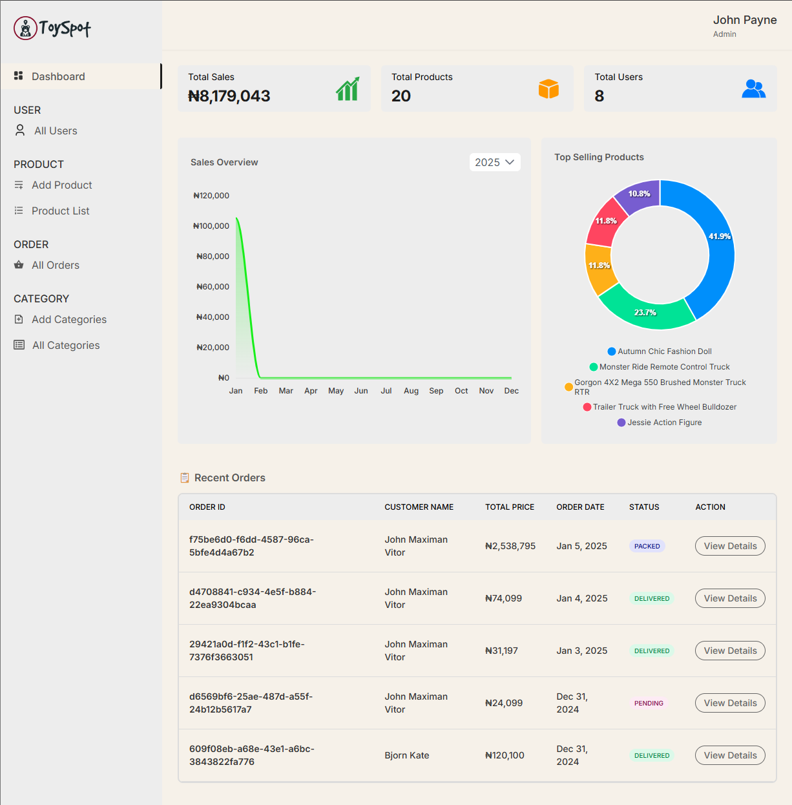
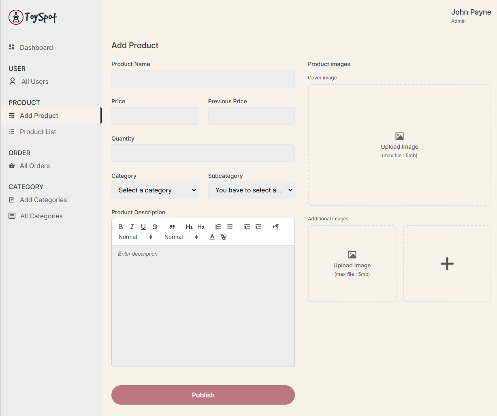
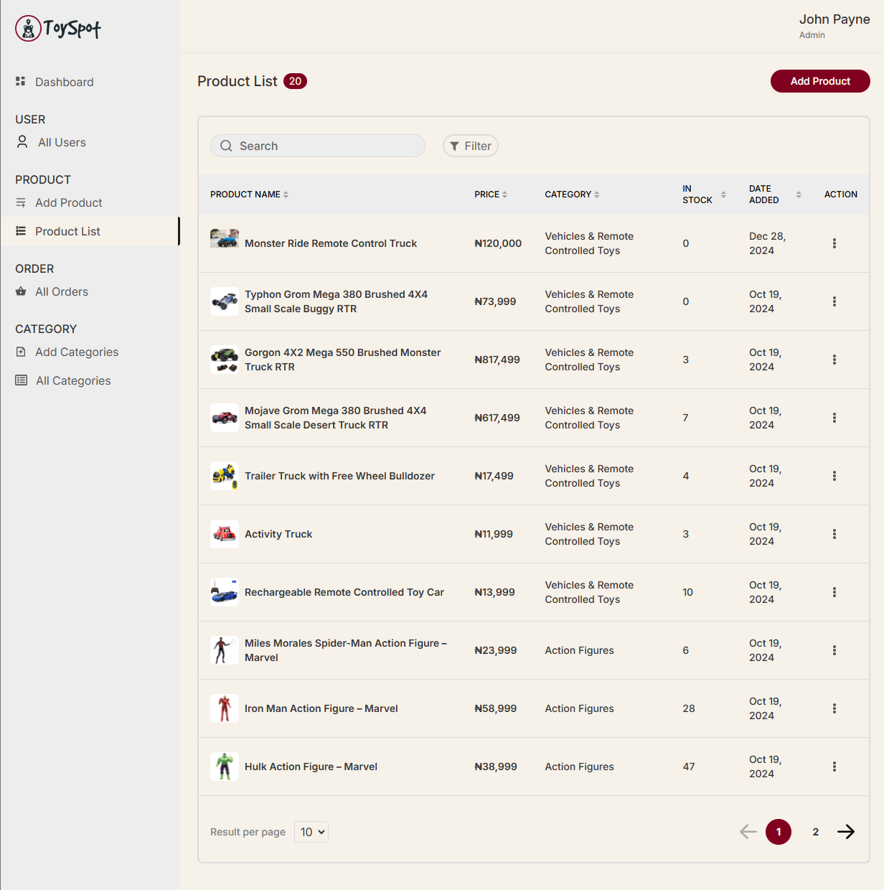
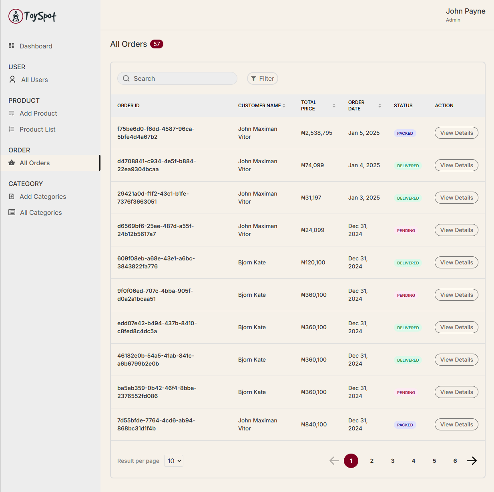
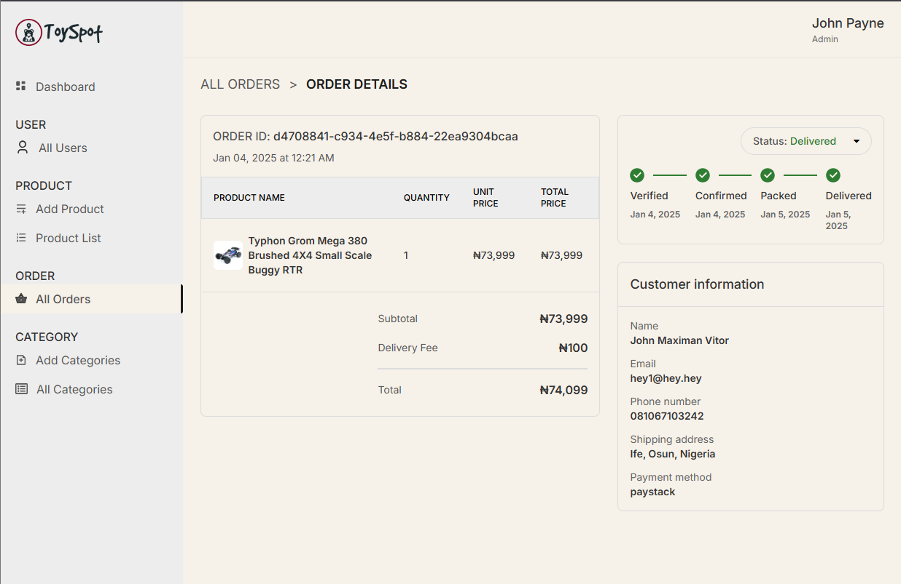

# Toyspot

## Description

Toyspot is an e-commerce application with separate user and admin dashboards. It provides a rich set of features, including product browsing, cart management, and an admin panel for managing products, orders, and users.

---

## Features

### General
- **Authentication**: Secure registration and login with route guards to protect routes.
- **State Management**: Application-wide states like cart and user states are managed using **NgRx**.

---

### User Features
- **Registration & Login**: Secure user authentication system.
- **Product Browsing**: View and search for products.
- **Cart Management**: Add, update, and remove items from the cart.
- **Checkout**: Options for payment on delivery or via Paystack.
- **User Profile**:
    - View and update personal details.
    - Manage addresses (add, edit, delete).
- **Product Reviews**: Submit feedback and ratings for purchased products.

---

### Admin Features
- **Admin Dashboard**:
    - **Platform Summary**: Overview of sales, users, products and orders.
    - **Charts**:
        - Monthly sales trends using **ApexCharts**.
        - Top-selling products.
    - **Tables**:
        - Recently placed orders.
        - Products low in stock.
- **User Management**: View, search, and filter user data.
- **Product Management**:
    - View, search, and filter products.
    - Add, edit and delete products.
- **Order Management**:
    - View and filter orders.
    - Update order delivery status.
- **Category Management**: Add, edit, and delete product categories.

---

## Technologies Used

- **Frontend**:
    - Angular
    - PrimeNG
    - ApexCharts
    - NgRx
    - NGX Quill Rich Text Editor

---

## Screenshots

### User/shop

### Admin 

## Development Server

Run `nx serve rl-ecommerce` for a dev server. Navigate to `http://localhost:4200/`. The app will automatically reload if you change any of the source files.

---

## Build

Run `nx build rl-ecommerce` to build the project. The build artifacts will be stored in the `dist/` directory. Use the `--configuration production` flag for a production build.

[//]: # (# RlEcommerce)

[//]: # ()
[//]: # (This project was generated with [Angular CLI]&#40;https://github.com/angular/angular-cli&#41; version 17.3.3.)

[//]: # ()
[//]: # (## Development server)

[//]: # ()
[//]: # (Run `ng serve` for a dev server. Navigate to `http://localhost:4200/`. The application will automatically reload if you change any of the source files.)

[//]: # ()
[//]: # (## Code scaffolding)

[//]: # ()
[//]: # (Run `ng generate component component-name` to generate a new component. You can also use `ng generate directive|pipe|service|class|guard|interface|enum|module`.)

[//]: # ()
[//]: # (## Build)

[//]: # ()
[//]: # (Run `ng build` to build the project. The build artifacts will be stored in the `dist/` directory.)

[//]: # ()
[//]: # (## Running unit tests)

[//]: # ()
[//]: # (Run `ng test` to execute the unit tests via [Karma]&#40;https://karma-runner.github.io&#41;.)

[//]: # ()
[//]: # (## Running end-to-end tests)

[//]: # ()
[//]: # (Run `ng e2e` to execute the end-to-end tests via a platform of your choice. To use this command, you need to first add a package that implements end-to-end testing capabilities.)

[//]: # ()
[//]: # (## Further help)

[//]: # ()
[//]: # (To get more help on the Angular CLI use `ng help` or go check out the [Angular CLI Overview and Command Reference]&#40;https://angular.io/cli&#41; page.)
